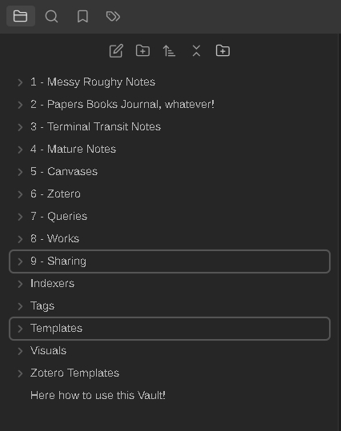
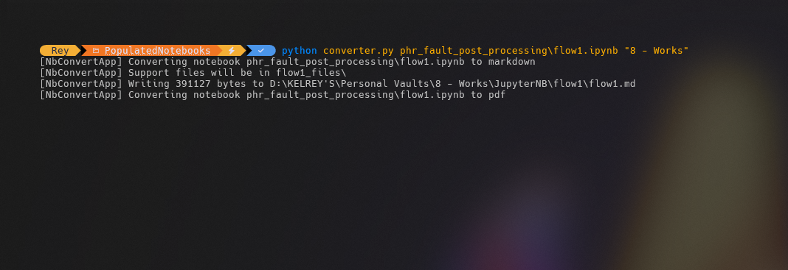
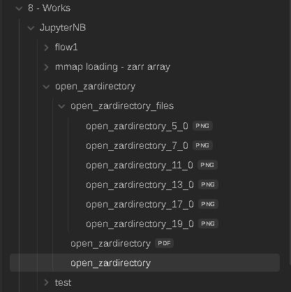
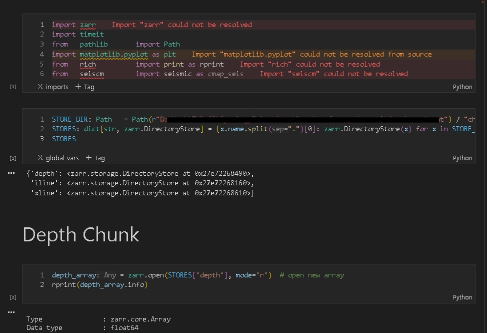
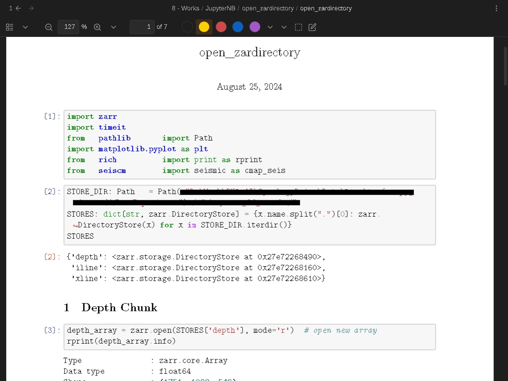
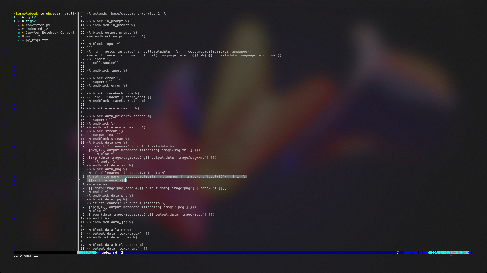
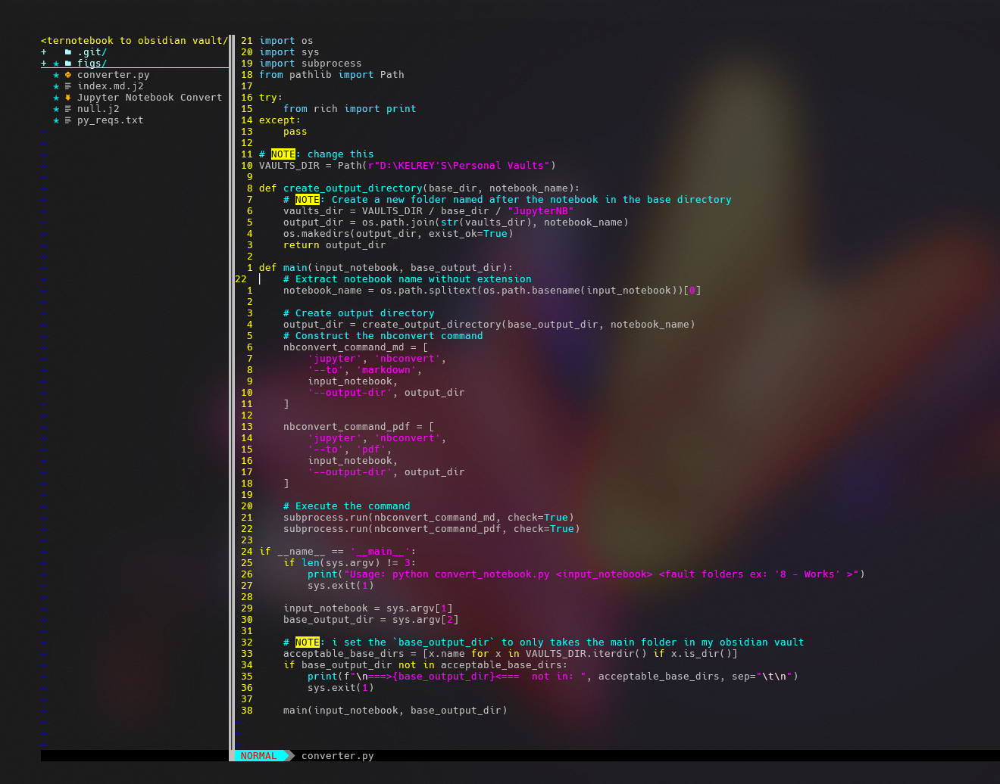

# Jupyter Notebook to Markdown (and PDF) directly to Obsidian Vault

## little background of why i'm doing this:

I'm working with python script and jupyter notebook a lot, and most of the time, i need to write record and write some report based on what's inside the notebook. i find it very exhausting that i have to manually copy and paste everything from notebook to my obsidian vault, which where i record literally everything.

I take [nbconvert](https://github.com/jupyter/nbconvert) ftw. so here i am.

fyi:

- im using windows
- im using python 3.10
- and none of the obsidian plugins for this workflow
- most of my plots in jupyternotebook is `.png` format

so, this workflow is based on

1. my main folder structure in obsidian fault
2. how [nbconvert](https://github.com/jupyter/nbconvert) handles notebook to markdown file, that:
   1. every image in cell output will be exported and located in a new sub-folder regardless of the target directory
   2. the markdown link of the image is not a relative path neither the image name (**this is a problem since obsidian recognizes it as a broken link**)

folder structure in my obsidian look like this



## How i use this

here, i run this on my terminal in the same directory where my jupyter notebook i want to convert located. you can run it wherever you want as long as you provide a correct path for the input notebook

```bash
python converter.py <notebook_name.ipynb> <obsidian_folder_target>
```

after run, it would show something like this



notice that the last argument `"8 - Works"` is one of my main folder in my vault. after i run that python script, it automatically creates a new folder called `JupyterNB` (u can name it whtvr you want by changing 1 line in the `converten.py`)



inside `JupyterNB` folder, nbconvert would automatically creates a folder with the same name as the input notebook name. inside that folder, there are
1. a sub-folder (name appended with `_files`) to hold every figure existed in the notebook. 
2. converted markdown, and
3. converted pdf

more about the [converter.py](converter.py) in section [this section](https://github.com/kelreeeeey/jupyternotebook-to-obsidian-vault/tree/main#python--converterpy)

here's the before afters
| Jupyter Notebook       | Markdown               | Pdf                    |
| ---------------------- | ---------------------- | ---------------------- |
|  |  |  |

## Dependencies

### Python 3.10

y'all can go here to install [jupyter-notebook](https://jupyter.org/install#jupyter-notebook) and the [nbconvert](https://github.com/jupyter/nbconvert)
or by run these commands on your terminal

```bash
python -m pip install jupyter
python -m pip install notebook
python -m pip install notebook
```

for brevity, bellow are the main package i use:

- Jinja2==3.1.4
- jupyter==1.0.0
- nbconvert==7.16.4
- notebook==6.4.12

y'all can find (probably) all related python package in [py_reqs.txt](py_reqs.txt)

### Obsidian

nothing, yeah, you heard me.

## The Scriptingss (jinja and python)

I tweaked 2 files of jinja template in nbconvert configuration, `null.j2` and `index.md.j2`
and i

### Jinja template

#### `null.j2`

y'all can find the `null.j2` file in below path (mine on windows btw)
`<< wherever y'all python installed >>\share\jupyter\nbconvert\templates\base\null.j2`

**I add obsidian-note's frontmatters in this template,** there are some restriction of what you can pull out from this jinja kinda thing, i've tried several but im not very familiar with jinja so this is the best i can try.

basically i just add these in the beginning of the file, (not at the very beginning, after the commented lines)

```jinja
---
kernel: {{ nb.metadata.language_info.name }}
notebook: {{ nb.metadata.kernelspec.display_name }}
tags: codings
source_type: jupyter_notebook
reviewed: false
---
```

so the modified `null.j2` would look like this:


for more detail of the format, please go to [The Notebook file format — nbformat 5.10 documentation](https://nbformat.readthedocs.io/en/latest/format_description.html) 
#### `index.md.j2`

`<< wherever y'all python installed >>\share\jupyter\nbconvert\templates\markdown\index.md.j2`

in `index.md.j2`, **my concern was on how nbconvert handle the path of figures cell's output** that appear to be a broken link in obsidian.

nbconvert returns a string of full path, (not the relative path or the filename) of the image and formats it using `![[ ... ]]`

as you can see in the code snipet below, the output.metadata is a key-value pair. as i said before, the filepath is a string of so

 **i tweak it by split the string, and take the last item.** note that im using `\\` since i'm working on WindowsOS.

```jinja
...



![[{{ file_name }}]]

![[ data:image/png;base64,{{ output.data['image/png'] | path2url }}]]


...
```

so the modified `index.md.j2` would look like this:

### Python -`converter.py`

as i meant before, i want my converted notebook be in a separate folder called `JupyterNB` regardless the target directory that were passed before. It is my preference as i can easily tell that whatever inside that folder, is generated from a jupyter notebook. feel free to explore tho, i don't want to dictate how people should take their notes in obsidian, im here to share :D. anyways, here's the snippet of the code
  

in general, you only have to change `VAULTS_DIR` variables in order to directly insert the converted notebook to your vaults, other than that, feel free to modify the code to match your workflow/preference(s). i specify the `JupyterNB` as folder name in function `create_output_directory`
